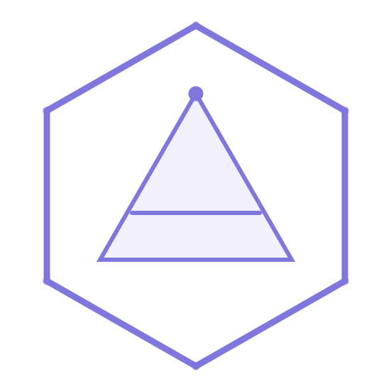

<p align="center">
  
</p>

<h1 align="center">Axiom</h1>

<p align="center">
  <b>Build Beyond Vanilla</b>
  <br><br>
  A modern, extensible Minecraft server plugin framework for building<br>
  powerful plugins with clean APIs, record-style conventions, and modern Java.
</p>

<p align="center">
  <a href="https://github.com/carson-hopper/axiom/blob/main/LICENSE"></a>
  <a href="https://github.com/carson-hopper/axiom/releases"></a>
  <a href="https://github.com/carson-hopper/axiom/actions"></a>
  
  
  <a href="STYLE.md"></a>
</p>

<p align="center">
  <a href="#getting-started">Getting Started</a> •
  <a href="#features">Features</a> •
  <a href="#documentation">Docs</a> •
  <a href="#contributing">Contributing</a> •
  <a href="#license">License</a>
</p>

---

## About

Axiom is an open-source plugin framework for Minecraft servers that provides a structured, opinionated foundation for building server plugins. Rather than wiring together boilerplate for every project, Axiom gives you the primitives — commands, events, permissions, configuration, GUIs, and more — wrapped in a modern Java API that feels like it belongs in 2025, not 2013.

Axiom follows **record-style accessor conventions** (`name()` instead of `getName()`), enforces clean architecture patterns, and targets **Java 25+** on **Fabric 0.18.5+** as its baseline.

## Features

- **Command Framework** — Annotation-driven command registration with automatic tab completion, argument parsing, and permission checks.
- **Event System** — Priority-ordered event handling with cancellation support and type-safe listeners.
- **Configuration** — YAML-backed configuration with type-safe accessors, hot-reload support, and sane defaults.
- **GUI Toolkit** — Chest-based inventory GUIs with a declarative builder API, pagination, and click handlers.
- **Permissions** — Roles-plus-nodes permission system with inheritance and per-world overrides.
- **Scheduling** — Async-aware task scheduling that abstracts the server tick loop.
- **Modern Java** — Records, sealed interfaces, pattern matching, text blocks — Axiom embraces modern Java idioms across the board.

## Getting Started

### Requirements

- **Java 25** or newer
- **Minecraft Server** — Fabric Loader 0.18.5+
- **Build Tool** — Gradle or Maven

### Installation

Add Axiom as a dependency in your project:

**Gradle (Kotlin DSL)**

```kotlin
repositories {
    maven("https://repo.axiommc.com/releases")
}

dependencies {
    compileOnly("com.axiommc:axiom-api:1.0.0")
}
```

**Maven**

```xml
<repository>
    <id>axiom</id>
    <url>https://repo.axiommc.com/releases</url>
</repository>

<dependency>
<groupId>com.axiommc</groupId>
<artifactId>axiom-api</artifactId>
<version>1.0.0</version>
<scope>provided</scope>
</dependency>
```

### Quick Example

```java
@Plugin(id = "example", name = "Example", version = "1.0.0", side = PluginSide.SERVER)
public class ExamplePlugin extends AxiomPlugin {

    @Override
    public void onEnable(PluginContext context) {
        commands().register(new GreetCommand());
        events().listen(PlayerJoinEvent.class, this::onJoin);
        logger().info("ExamplePlugin enabled!");
    }

    private void onJoin(PlayerJoinEvent event) {
        event.player().sendMessage("Welcome to the server!");
    }
}
```

## Documentation

Full documentation is available at **[docs.axiommc.com](https://docs.axiommc.com)** *(coming soon)*.

| Resource | Description |
|---|---|
| [API Reference](https://docs.axiommc.com/api) | Javadoc for all public APIs |
| [Guides](https://docs.axiommc.com/guides) | Step-by-step tutorials for common tasks |
| [Examples](examples/) | Runnable example plugins in this repository |
| [Style Guide](STYLE.md) | Java coding standards enforced in this project |

## Contributing

Contributions are welcome and appreciated! Before opening a PR, please read the following carefully.

### Code Style

This project enforces a strict code style based on the [Google Java Style Guide](https://google.github.io/styleguide/javaguide.html) with **record-style accessor naming**. See [`STYLE.md`](STYLE.md) for the full guide. The key points:

- **No `get`/`set` prefixes** — use `name()`, not `getName()`. The `is` prefix is retained for booleans.
- **2-space indentation**, 100-character column limit.
- **Format with `google-java-format`** before committing.
- **Commits must follow [Conventional Commits](https://www.conventionalcommits.org/)** with module-scoped prefixes (e.g., `feat(commands): add tab completion`).

> **Pull requests that do not follow the style guide will be rejected.** Run the formatter and linter before pushing — CI will catch violations anyway.

### How to Contribute

1. **Fork** the repository.
2. **Create a branch** from `main` for your feature or fix.
3. **Write code** following the style guide and add tests where applicable.
4. **Format** your code: `java -jar google-java-format.jar --replace src/**/*.java`
5. **Commit** using Conventional Commits: `feat(gui): add pagination support`
6. **Open a PR** against `main` with a clear description of the change.

### Reporting Issues

Open an issue on GitHub with a clear title and as much detail as possible. Include Minecraft version, Java version, server software, and steps to reproduce.

## License

Axiom is licensed under the **GNU General Public License v3.0** — see the [`LICENSE`](LICENSE) file for details.

This means:

- You are **free to use, modify, and distribute** this software.
- Any modified versions **must also be open-source** under GPL v3.
- You **must give credit** to the original authors and indicate changes made.
- You **must include the original license** and copyright notice in any distribution.

---

<p align="center">
  <sub>Built with care by the Axiom community.</sub>
</p>